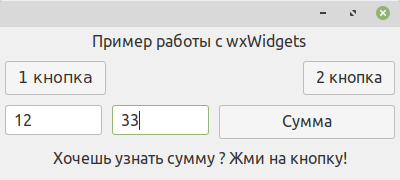

# wxPython_demo
Пример оконной программы на wxPython c wxWidgets и кодом формы от wxFormBuilder



```
#!/usr/bin/env python3
# coding=utf-8

import wx
import wx.xrc

from MainFrameBase import MainFrameBase


class MainFrame(MainFrameBase):

    def onClick1(self, event):
        dlg = wx.MessageDialog(self, "Hello!", "wxPython", wx.OK)
        dlg.ShowModal()
        dlg.Destroy()

    def onClick2(self, event):
        wx.MessageDialog(self, "Приветик!", "TSN", wx.OK).ShowModal()

    def onSum(self, event):
        try:
            a = float(self.m_textCtrl1.GetValue())
            b = float(self.m_textCtrl2.GetValue())
            c = a + b
            self.m_staticText_Sum.SetLabelText(str(c))
        except:
            self.m_staticText_Sum.SetLabelText("не могу понять тебя!")


def main():
    app = wx.App(False)
    frame = MainFrame(None)
    frame.Show(True)
    app.MainLoop()


if __name__ == '__main__':
    main()

```

## https://wxpython.org

Установка:
```
pip3 install -U wxPython
```

или так:
```
sudo apt-get install python-wxgtk3.0
```

---
### Как сделать портативную программу в виде одного исполняемого файла:
```
pip3 install pyinstaller
pyinstaller --onefile --windowed start.py
```
---
## wxFormBuilder
https://github.com/wxFormBuilder/wxFormBuilder
